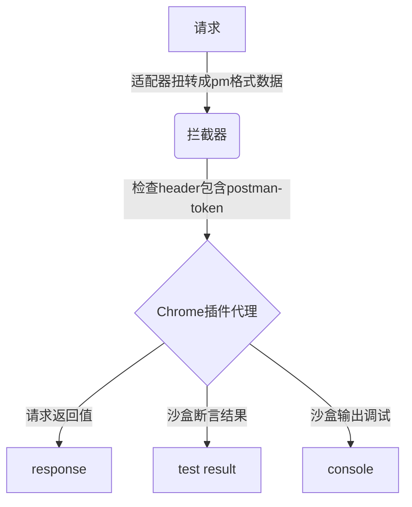
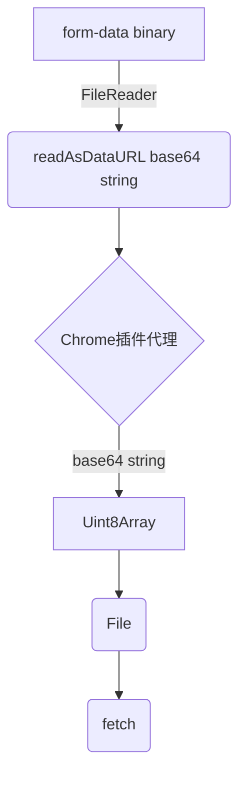

## AREX 如何实现纯web端完成各类API调试？

要纯web端想实现各类API的调试工作，首当其冲要解决的是浏览器跨域问题。

### 什么是跨域

浏览器跨域问题是指在Web开发中，当使用JavaScript代码从一个域名的网页访问另一个域名的资源时会遇到的限制。浏览器实施了一种安全策略，称为同源策略（Same-Origin Policy），
用于保护用户信息的安全。同源策略要求网页中的JavaScript只能访问与其来源（协议、域名和端口号）相同的资源，而对于不同域名的资源访问会受到限制。

由于浏览器存在跨域限制，我们不能在浏览器端随心所欲的发送http请求，这是浏览器的安全策略决定的。经调研突破此限制的方法有两种
分别是chrome插件代理和服务端代理，以下是两种方法的比较。


|      | chrome插件代理               | 服务端代理          |
|------|--------------------------|---------------|
| 访问本地 | 可以                       | 不可以           |
| 速度   | 无请求时间损耗                  | 整个流程速度受代理接口影响 |
| 实际请求 | 已知Origin源会被修改为chrome插件的源 | 完全一样          |


权衡下来AREX选择了chrome插件代理的方法，插件名为Arex Chrome Extension，其原理是利用了chrome插件
中background可以发送跨域请求，我们将浏览器端拦截到的请求通过window.postmassage与chrome插件的background进行
通信。(其中通信还需要chrome插件的content-script作为数据桥梁)

在页面脚本中：

1.生成一个随机的字符串，并将其转换为字符串形式，存储在tid变量中。
2.使用window.postMessage()方法发送一条消息到其他扩展程序，消息包括一个类型为__AREX_EXTENSION_REQUEST__的标识、tid、以及params参数。
3.添加一个message事件监听器receiveMessage，用于接收其他扩展程序发送的消息。
4.在receiveMessage函数中，检查接收到的消息是否为类型为__AREX_EXTENSION_RES__，并且tid与之前发送的消息的tid相匹配。如果匹配成功，则移除事件监听器。

在内容脚本中：

1.添加一个message事件监听器，用于接收来自页面脚本或其他扩展程序发送的消息。
2.在事件监听器中，检查接收到的消息是否为类型为__AREX_EXTENSION_REQUEST__，如果是，则使用chrome.runtime.sendMessage()方法将消息发送给后台脚本。
3.在接收到来自后台脚本的响应后，使用window.postMessage()方法将响应消息发送回页面脚本或其他扩展程序。

在后台脚本中：

1.使用chrome.runtime.onMessage.addListener()方法添加一个监听器，用于接收来自内容脚本或其他扩展程序发送的消息。
2.在监听器中可以处理接收到的消息，并根据需要作出响应。

```js
// arex
const tid = String(Math.random());
window.postMessage(
  {
    type: '__AREX_EXTENSION_REQUEST__',
    tid: tid,
    payload: params,
  },
  '*',
);
window.addEventListener('message', receiveMessage);
function receiveMessage(ev: any) {
  if (ev.data.type === '__AREX_EXTENSION_RES__' && ev.data.tid == tid) {
    window.removeEventListener('message', receiveMessage, false);
  }
}
// content-script.js
window.addEventListener("message", (ev) => {
  if (ev.data.type === "__AREX_EXTENSION_REQUEST__"){
    chrome.runtime.sendMessage(ev.data, res => {
      //   与background通信
      window.postMessage(
        {
          type: "__AREX_EXTENSION_RES__",
          res,
          tid:ev.data.tid
        },
        "*"
      )
    })
  }
})
// background.js
chrome.runtime.onMessage.addListener((req, sender, sendResponse) => {

})
```

上述已经解决了跨域问题，下面介绍一下整个API调试的流程。postman是业内成熟的API调试工具，
我们引入了postman的JavaScript沙盒，站在了postman这位巨人的肩膀上，主要使用
了他的沙盒运行前置脚本、后置脚本以及断言来调试API。 当点击发送按钮的时候，会将表单中的数据汇聚到一次，数据结构为

```ts
export interface Request {
  id: string;
  name: string;
  method: string;
  endpoint: string;
  params: {key:string,value:string}[];
  headers: {key:string,value:string}[];
  preRequestScript: string;
  testScript: string;
  body: {contentType:string,body:string};
}
```
这是AREX的数据结构，我们会对其进行一次数据扭转，转换成postman的数据结构。之后调用PostmanRuntime.Runner()方法，将扭转好了的postman
数据结构和当前所选的环境变量传入，Runner会执行preRequestScript和testScript脚本，preRequestScript发生请求之前，可以在其中穿插请求
以及对请求参数、环境变量进行操作，testScript发生在请求之后，可以对response返回数据进行断言操作，并且脚本中也可以通过console.log输出
数据，在控制台进行调试。

```javascript
var runner = new runtime.Runner(); // runtime = require('postman-runtime');

// 一个标准的postman集合对象
var collection = new sdk.Collection();

runner.run(collection, {}, function (err, run) {
    run.start({
      assertion:function (){}, //断言
      prerequest:function (){}, // 预请求勾子
      test:function (){}, //测试勾子
      response:function (){} //返回勾子
    });
});
```

同样postman沙盒也存在跨域问题，由于postman沙盒的集成度非常高，为了保证以后可以轻便的与PostmanRuntime保持同步，我们采用了ajax
拦截技术，在浏览器端进行ajax拦截，所有postman沙盒发出的请求都会携带"postman-token"的请求头，我们拦截到了ajax请求会把请求参数
拼装好通过window.postmassage发送给浏览器插件，浏览器插件再次构建fetch请求把数据返回，让postman沙盒输出最终结果，最终结果包含response、
testResult和console.log。(值得注意的是responseType必须指定是arraybuffer)

具体步骤

1.使用xspy.onRequest()方法注册一个请求处理程序。这个处理程序接受两个参数：request和sendResponse。request参数包含请求的相关信息，例如方法、URL、头部、请求体等。sendResponse是一个回调函数，用于发送响应给请求方。

2.在处理程序中，通过检查请求的头部中是否存在postman-token来判断请求是否来自Postman。如果存在该头部，表示请求是通过Postman发送的。

3.如果请求是来自Postman，则使用AgentAxios（可能是一个自定义的Axios实例）发起一个新的请求，使用原始请求的方法、URL、头部和请求体。AgentAxios返回一个agentData对象，其中包含了响应的状态码、头部和数据等信息。

4.创建一个名为dummyResponse的响应对象，包含了与原始请求相关的信息。dummyResponse的status字段为agentData的状态码，headers字段为将agentData的头部数组转换为对象格式的结果，ajaxType字段为字符串xhr，responseType字段为字符串arraybuffer，response字段为将agentData的数据转换为JSON字符串并用Buffer包装的结果。

5.使用sendResponse(dummyResponse)将响应发送给请求方。

6.如果请求不是来自Postman，则直接调用sendResponse()，表示不返回任何响应。

```js
xspy.onRequest(async (request: any, sendResponse: any) => {
  // 判断是否是pm发的
  if (request.headers['postman-token']) {
    const agentData: any = await AgentAxios({
      method: request.method,
      url: request.url,
      headers: request.headers,
      data: request.body,
    });
    const dummyResponse = {
      status: agentData.status,
      headers: agentData.headers.reduce((p: any, c: { key: any; value: any }) => {
        return {
          ...p,
          [c.key]: c.value,
        };
      }, {}),
      ajaxType: 'xhr',
      responseType: 'arraybuffer',
      response: new Buffer(JSON.stringify(agentData.data)),
    };
    sendResponse(dummyResponse);
  } else {
    sendResponse();
  }
});

```

以下是AREX请求的流程图



以上是arex调试的整体流程，其中还有一点值得一提。对于x-www-form-urlencoded和raw都是好
处理的，他们都是普通的json对象，但是对于form-data、binary类型是需要支持二进制文件请求
负载的，然而chrome插件的postmassage通信方式是不支持二进制对象序列化传递的，就这个问题
我们采用了base64编码技术，在选择文件时我们会将二进制文件转换成base64字符串，再进行传输
chrome插件端再将base64数据进行转换，再构建实际的fetch请求。

以下是代码分析

1.toBase64 函数接受一个 File 对象作为参数，并返回一个 Promise 对象，该 Promise 对象将解析为表示文件的 Base64 字符串。

2.在函数内部，创建了一个 FileReader 对象。
通过调用 reader.readAsDataURL(file) 将文件读取为 Data URL。
当读取操作完成时，通过 reader.onload 事件处理程序将读取结果解析为字符串，并使用 resolve 将其传递给 Promise。
如果发生错误，将使用 reject 将错误传递给 Promise。
base64ToFile 函数接受两个参数：dataurl（Base64 字符串）和 filename（文件名），并返回一个 File 对象。

3.首先，将 dataurl 使用逗号分割成数组 arr，如果分割结果为空，则将其设为包含一个空字符串的数组。
通过正则表达式匹配 arr[0] 中的内容，提取出 MIME 类型，即数据的类型。
使用 atob 将 Base64 字符串解码为二进制字符串 bstr。
创建一个长度为 n 的 Uint8Array 数组 u8arr。
使用循环遍历 bstr，将每个字符的 Unicode 编码放入 u8arr 中。
最后，使用 File 构造函数创建并返回一个新的 File 对象，其中包含了从 u8arr 中读取的文件数据、文件名和 MIME 类型。
导出 base64ToFile 函数，以便在其他地方使用。

```ts
// 文件转Base64
const toBase64 = (file: File): Promise<string> =>
  new Promise((resolve, reject) => {
    const reader = new FileReader();
    reader.readAsDataURL(file);
    reader.onload = () => resolve(reader.result as string);
    reader.onerror = reject;
  });
// base64转文件
function base64ToFile(dataurl: string, filename: string) {
  const arr = dataurl.split(',') || [''],
    mime = arr[0].match(/:(.*?);/)?.[1],
    bstr = atob(arr[1]);
  let n = bstr.length;
  const u8arr = new Uint8Array(n);
  while (n--) {
    u8arr[n] = bstr.charCodeAt(n);
  }
  return new File([u8arr], filename, { type: mime });
}

export default base64ToFile;

```

这是一个流程图，描述了将 FormData 中的二进制文件转换为 Base64 字符串，并通过 Chrome 插件代理将其转换回文件并进行进一步处理的过程。下面是对流程图的分析：



1.form-data binary（A）：表示一个包含二进制文件的 FormData 表单数据。

2.FileReader（B）：使用 FileReader 对象来读取二进制文件。

3.readAsDataURL base64 string：FileReader 使用 readAsDataURL 方法将二进制文件读取为 Base64 字符串。

4.Chrome 插件代理（C）：Base64 字符串经过读取操作后，传递给 Chrome 插件代理进行进一步处理。

5.base64 string：表示经过 FileReader 读取二进制文件后得到的 Base64 字符串。

6.Uint8Array（D）：在 Chrome 插件代理中，将 Base64 字符串转换为 Uint8Array。

7.File（E）：使用 Uint8Array 的数据创建一个新的 File 对象。

8.fetch（F）：将新创建的 File 对象通过 fetch 方法或其他方式进行进一步处理，例如上传到服务器或进行其他操作。

这个流程图描述了从表单中获取包含二进制文件的 FormData 数据，然后使用 FileReader 将二进制文件转换为 Base64 字符串。
接着，通过 Chrome 插件代理，将 Base64 字符串转换回 Uint8Array，并使用 Uint8Array 创建一个新的 File 对象。最后，使用 fetch 方法或其他方式对 File 对象进行进一步处理。


至此，整个arex调试的内部远离大致已经介绍完毕。有一些已知的问题可以列举一下。
- 大型文件的上传，大型文件进行base64转码传输会有较大性能问题，考虑是否可以通过文件流的方式
- chrome插件的origin源无法修改，还无法做到完全与无头浏览器一致
