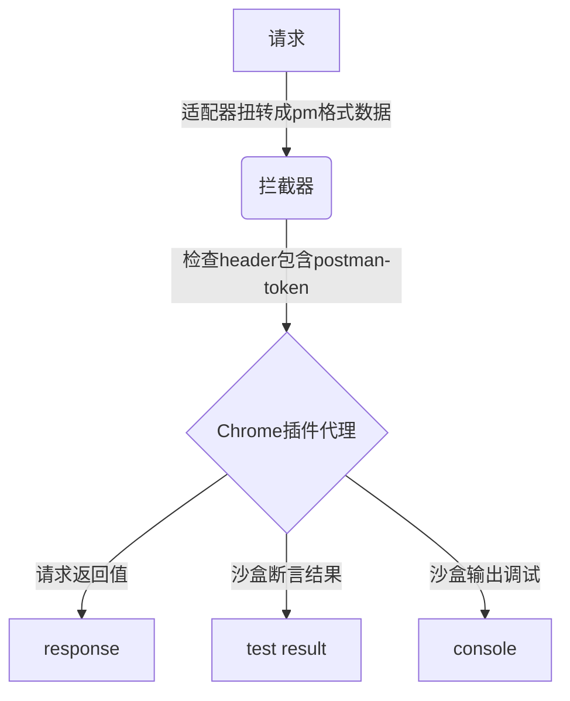
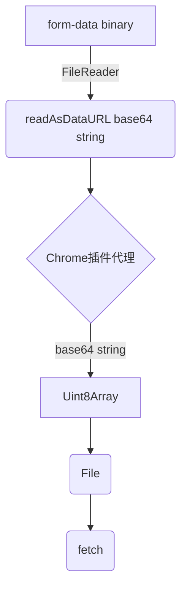

### AREX 如何实现纯web端完成各类API调试？

要想实现各类API的调试工作，首当其冲要解决的是浏览器跨域问题。 由于浏览器存在跨域限制，我们不能在浏览器端随心所欲的发送http请求，这是浏览器的安全策略决定的。目前可以突破此限制的方法有两种
分别是chrome插件代理和服务端代理，以下是两种方法的比较。


|      | chrome插件代理               | 服务端代理          |
|------|--------------------------|---------------|
| 访问本地 | 可以                       | 不可以           |
| 速度   | 无请求时间损耗                  | 整个流程速度受代理接口影响 |
| 实际请求 | 已知Origin源会被修改为chrome插件的源 | 完全一样          |


权衡下来AREX选择了chrome插件代理的方法，插件名为Arex Chrome Extension，其原理是利用了chrome插件
中background可以发送跨域请求，我们将浏览器端拦截到的请求通过window.postmassage与chrome插件的background进行
通信。(其中通信还需要chrome插件的content-script作为数据桥梁)
```js
// arex
const tid = String(Math.random());
window.postMessage(
  {
    type: '__AREX_EXTENSION_REQUEST__',
    tid: tid,
    payload: params,
  },
  '*',
);
window.addEventListener('message', receiveMessage);
function receiveMessage(ev: any) {
  if (ev.data.type === '__AREX_EXTENSION_RES__' && ev.data.tid == tid) {
    window.removeEventListener('message', receiveMessage, false);
  }
}
// content-script.js
window.addEventListener("message", (ev) => {
  if (ev.data.type === "__AREX_EXTENSION_REQUEST__"){
    chrome.runtime.sendMessage(ev.data, res => {
      //   与background通信
      window.postMessage(
        {
          type: "__AREX_EXTENSION_RES__",
          res,
          tid:ev.data.tid
        },
        "*"
      )
    })
  }
})
// background.js
chrome.runtime.onMessage.addListener((req, sender, sendResponse) => {

})
```

上述已经解决了跨域问题，下面介绍一下整个API调试的流程。postman是业内成熟的API调试工具，
我们引入了postman的JavaScript沙盒，站在了postman这位巨人的肩膀上，主要使用
了他的沙盒运行前置脚本、后置脚本以及断言来调试API。 当点击发送按钮的时候，会将表单中的数据汇聚到一次，数据结构为

```ts
export interface Request {
  id: string;
  name: string;
  method: string;
  endpoint: string;
  params: {key:string,value:string}[];
  headers: {key:string,value:string}[];
  preRequestScript: string;
  testScript: string;
  body: {contentType:string,body:string};
}
```
这是AREX的数据结构，我们会对其进行一次数据扭转，转换成postman的数据结构。之后调用PostmanRuntime.Runner()方法，将扭转好了的postman
数据结构和当前所选的环境变量传入，Runner会执行preRequestScript和testScript脚本，preRequestScript发生请求之前，可以在其中穿插请求
以及对请求参数、环境变量进行操作，testScript发生在请求之后，可以对response返回数据进行断言操作，并且脚本中也可以通过console.log输出
数据，在控制台进行调试。

```javascript
var runner = new runtime.Runner(); // runtime = require('postman-runtime');

// 一个标准的postman集合对象
var collection = new sdk.Collection();

runner.run(collection, {}, function (err, run) {
    run.start({
      assertion:function (){}, //断言
      prerequest:function (){}, // 预请求勾子
      test:function (){}, //测试勾子
      response:function (){} //返回勾子
    });
});
```

同样postman沙盒也存在跨域问题，由于postman沙盒的集成度非常高，为了保证以后可以轻便的与PostmanRuntime保持同步，我们采用了ajax
拦截技术，在浏览器端进行ajax拦截，所有postman沙盒发出的请求都会携带"postman-token"的请求头，我们拦截到了ajax请求会把请求参数
拼装好通过window.postmassage发送给浏览器插件，浏览器插件再次构建fetch请求把数据返回，让postman沙盒输出最终结果，最终结果包含response、
testResult和console.log。

```js
xspy.onRequest(async (request: any, sendResponse: any) => {
  // 判断是否是pm发的
  if (request.headers['postman-token']) {
    const agentData: any = await AgentAxios({
      method: request.method,
      url: request.url,
      headers: request.headers,
      data: request.body,
    });
    const dummyResponse = {
      ajaxType: 'fetch',
      status: agentData.status,
      headers: agentData.headers,
      statusText: 'OK',
      ok: true,
      redirected: false,
      type: 'basic',
      body: JSON.stringify(agentData.data),
      url: 'https://...',
    };
    sendResponse(dummyResponse);
  } else {
    sendResponse();
  }
});

```

以下是AREX请求的流程图



以上是arex调试的整体流程，其中还有一点值得一提。对于x-www-form-urlencoded和raw都是好
处理的，他们都是普通的json对象，但是对于form-data、binary类型是需要支持二进制文件请求
负载的，然而chrome插件的postmassage通信方式是不支持二进制对象序列化传递的，就这个问题
我们采用了base64编码技术，在选择文件时我们会将二进制文件转换成base64字符串，再进行传输
chrome插件端再将base64数据进行转换，再构建实际的fetch请求。

```ts
// 文件转Base64
const toBase64 = (file: File): Promise<string> =>
  new Promise((resolve, reject) => {
    const reader = new FileReader();
    reader.readAsDataURL(file);
    reader.onload = () => resolve(reader.result as string);
    reader.onerror = reject;
  });
// base64转文件
function base64ToFile(dataurl: string, filename: string) {
  const arr = dataurl.split(',') || [''],
    mime = arr[0].match(/:(.*?);/)?.[1],
    bstr = atob(arr[1]);
  let n = bstr.length;
  const u8arr = new Uint8Array(n);
  while (n--) {
    u8arr[n] = bstr.charCodeAt(n);
  }
  return new File([u8arr], filename, { type: mime });
}

export default base64ToFile;

```

以下是数据扭转流程



至此，整个arex调试的内部远离大致已经介绍完毕。有一些已知的问题可以列举一下。
- 大型文件的上传，大型文件进行base64转码传输会有较大性能问题，考虑是否可以通过文件流的方式
- chrome插件的origin源无法修改，还无法做到完全与无头浏览器一致
